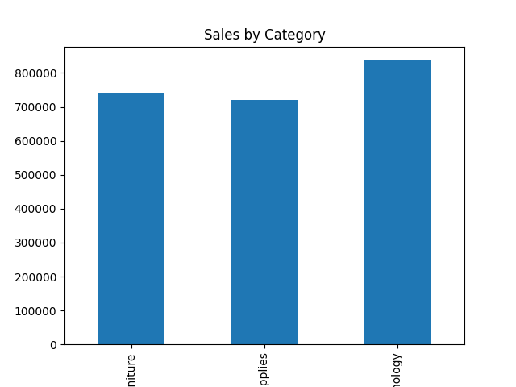

# 📊 Sales Data Analysis Project

## 📌 Project Overview
This project analyzes a retail sales dataset to uncover business insights related to revenue, profit, product categories, and regional performance.

The goal is to demonstrate data analysis, visualization, and business insight generation using Python.

---

## 🛠 Tools & Technologies Used
- Python
- Pandas
- Matplotlib
- Git & GitHub

---

## 📂 Dataset
The dataset contains 9,994 sales records with 21 columns including:

- Sales
- Profit
- Category
- Sub-Category
- State
- Region
- Discount
- Quantity

---

## 📊 Key Business Insights

### 🔹 Total Sales
$2,297,200

### 🔹 Total Profit
$286,397

### 🔹 Sales by Category
- Technology generates the highest sales.
- Furniture generates lower profit compared to sales.
- Office Supplies has stable profitability.

### 🔹 Top 5 States by Sales
1. California
2. New York
3. Texas
4. Washington
5. Pennsylvania

---

## 📈 Visualizations Included
- Sales by Category (Bar Chart)
- Profit by Category
- Top 5 States by Sales

---

## ▶ How to Run the Project

1. Clone the repository
2. Install required libraries:
   ```bash
   pip install pandas matplotlib
3.Run:
   ```bash
   python analysis.py
   ```

##🎯 Project Objective

This project demonstrates:

Data cleaning

Exploratory Data Analysis (EDA)

Business insight extraction

Data visualization

Git version control

##🚀 Future Improvements

Add interactive dashboards (Streamlit / Power BI)

Perform predictive analysis

Add time-series sales trend analysis

## 📸 Project Screenshots

### 📊 Sales by Category


### 💰 Profit by Category


### 🏆 Top 5 States by Sales
